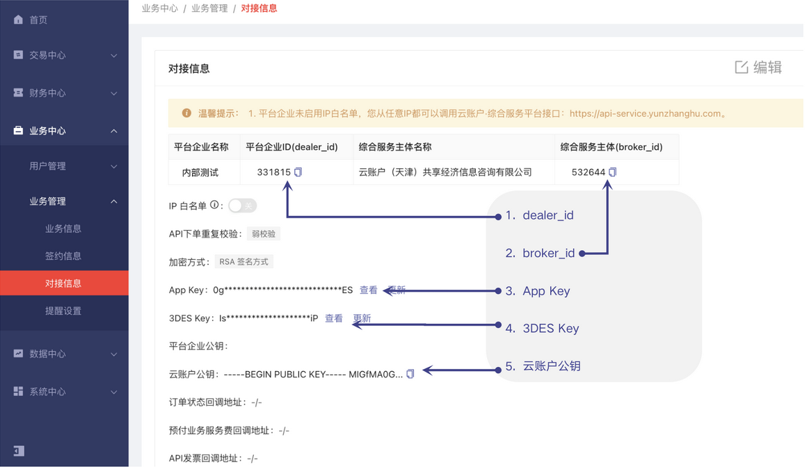
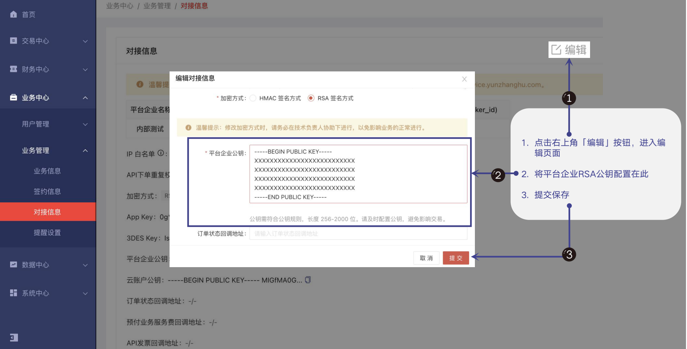

# 云账户 SDK for PHP

## 功能概述

### 1、简介

欢迎使用 云账户 SDK for PHP 。

云账户 SDK for PHP 包含了请求的封装，加解密，签名验签等功能，使用 SDK 可轻松、快速完成 API 的调用和结果处理。

这里向您介绍如何快速使用云账户 SDK for PHP 。 如果您在使用过程中遇到任何问题，欢迎在当前 GitHub 提交 Issues，或发送邮件至技术支持组 [techsupport@yunzhanghu.com](mailto:techsupport@yunzhanghu.com) 。

### 2、获取配置

#### **获取 dealer_id、broker_id、3DES Key、App Key**

使用根据开户邮件中的账号登录云账户综合服务平台，选择“业务中心 > 业务管理 > 对接信息”查看并获取配置信息。



#### **配置平台企业公钥**

##### **生成密钥**

- 方式一：使用 OpenSSL 生成 RSA 公私钥

```
① ⽣成私钥 private_key.pem

Openssl-> genrsa -out private_key.pem 2048 # 建议密钥⻓度⾄少为 2048

【Java 开发者需要将私钥转换成 PKCS8 格式，非 Java，则跳过本步骤】OpenSSL-> pkcs8 -topk8 -inform PEM -in private_key.pem -outform PEM -nocrypt -out private_key_pkcs8.pem

② ⽣成公钥⽂件 pubkey.pem

Openssl-> rsa -in private_key.pem -pubout -out pubkey.pem
```

- 方式二：使用工具生成

  请联系云账户技术支持获取 RSA 密钥生成工具。

##### **上传平台企业公钥**

登录云账户综合服务平台，选择“业务中心  > 业务管理  > 对接信息”，单击页面右上角的“编辑”，配置平台企业公钥。

## 环境要求

### 1、版本要求

- PHP 5.4以上版本

### 2、快速使用

1、安装依赖

```
composer install
```

2、Composer 安装 SDK

```
composer require yunzhanghuopen/sdk-php
```

### 3、示例功能列表      

### 3、示例功能列表      

- [H5 签约](example/h5UserSign.php ) or [API 签约](example/apiUserSign.php )  
- [实时下单接口](example/payment.php ) 
- [订单异步回调](example/notify.php )     
- [数据接口](example/dataService.php )    
- [发票接口](example/invoice.php )     
- [个税扣缴明细表下载接口](example/tax.php )       
- [用户信息验证接口](example/verify.php )
